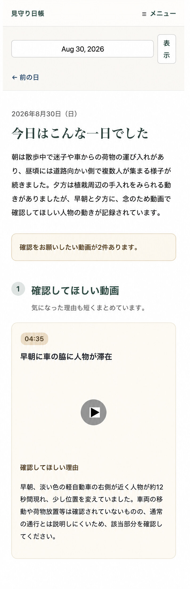

# Reolink Daily Observer

防犯カメラは人物を検知して録画できても、増え続ける映像を毎日見返すには時間と手間がかかります。Reolink Daily Observer は、**カメラが人物を検知して録画した MP4 ファイル群を解析し、その日の日報を作成してブラウザに表示する**ためのシステムです。

## 日報の例

家族向け日報では、一日の概要と、確認してほしい動画・理由をまとめて表示します。

<p align="center">
  
</p>

## 日報を表示するまで

### 前提

- Linux と Docker Engine / Docker Compose
- カメラが人物検知時の MP4 をホストへ保存する仕組み
- OpenAI API key

入力ディレクトリは `YYYY/MM/DD` と `YYYY-MM-DD` の日付構成に対応しています。OpenAI API の利用には料金が発生します。

### 1. 初期設定

```bash
git clone https://github.com/Yoto/reolink-daily-observer.git
cd reolink-daily-observer

cp .env.example .env
cp config/scene.example.yaml config/scene.yaml
sudo install -d -o 10001 -g 10001 -m 0750 /srv/reolink-analysis/output /srv/reolink-analysis/state
```

`.env` を編集し、少なくとも次を実環境に合わせます。

- `CAMERA_INPUT_DIR`: カメラが保存した MP4 のルート
- `ANALYSIS_OUTPUT_DIR` / `ANALYSIS_STATE_DIR`: 日報と処理状態の保存先
- `OPENAI_API_KEY`: OpenAI API key
- 各サービスの UID / GID

`config/scene.yaml` には、必要に応じて撮影場所や普段の行動を個人名ではなく役割・振る舞いで記述します。詳しくは [Configuration](docs/configuration.md) を参照してください。

### 2. イメージを構築する

```bash
docker compose --env-file .env build
```

### 3. 対象日の日報を作成する

初回確認では、日付を指定して同期実行すると結果をその場で確認できます。

```bash
docker compose --env-file .env run --rm analyzer --date YYYY-MM-DD --sync
```

通常の日次実行は次のコマンドで前日分を処理します。既定では画像解析に Batch API を使うため、完了まで時間がかかる場合があります。

```bash
docker compose --env-file .env run --rm analyzer
```

### 4. viewer を起動する

```bash
docker compose --env-file .env up -d viewer nginx
```

ブラウザで `http://localhost/` を開きます。`VIEWER_HTTP_PORT` を変更した場合は、そのポートを指定してください。

## プライバシーと公開範囲

- 入力 MP4 は read-only でマウントし、移動・変更・削除しません。
- OpenAI API へは、動画から抽出して縮小した JPEG と prompt、および event JSON、scene、日報履歴などのテキストを送信します。元の MP4 自体は直接送信しません。
- MP4、event JSON、日報、SQLite、ログ、`config/scene.yaml` には、人物の行動や在宅状況などが含まれ得ます。機密データとして保護してください。
- `.env` と `config/scene.yaml` は Git と Docker build context の除外対象ですが、強制追加や誤った公開までは防げません。
- viewer には認証機能がありません。ルーターから直接インターネットへ公開せず、信頼できる LAN または VPN、Tailscale、WireGuard などの private network 内で利用してください。

送信データと権限設定の詳細は [Configuration: Privacy](docs/configuration.md#privacy) と [Viewer: Security boundary](docs/viewer.md#security-boundary) を参照してください。

## ライセンス

このプロジェクトは [MIT License](LICENSE) の下で公開されています。依存ソフトウェアと外部 API には、それぞれの提供元のライセンスおよび利用規約が適用されます。

## ドキュメント

| ドキュメント | 内容 |
| --- | --- |
| [Architecture](docs/architecture.md) | システム構成、observation / triage / report の責務 |
| [Configuration](docs/configuration.md) | `.env`、解析設定、private な scene、送信データ |
| [Operations](docs/operations.md) | 日次実行、Batch API、定期実行、障害対応 |
| [Viewer](docs/viewer.md) | 日報 UI、動画配信、権限とセキュリティ |
| [Tuning and Evaluation](docs/tuning-and-evaluation.md) | 誤検知の改善方針と回帰評価 |
| [Development](docs/development.md) | ローカル開発、mock、テスト |
| [Frontend preview](docs/preview.md) | 本番データを read-only で使う UI レビュー環境 |
| [scene-author](docs/scene-author.md) | 実動画から scene の追加候補を作る補助コマンド |
